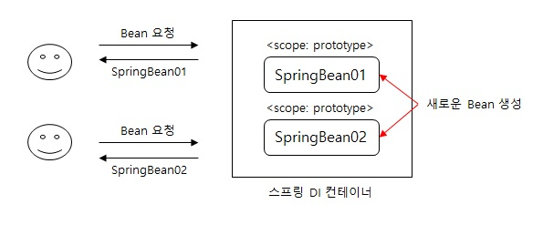

# Bean Scope
Scope는 Bean이 존재할 수 있는 범위이다.

## (1) Scope 종류
<1> 싱글톤: 기본 스코프이며 스프링 컨테이너의 시작과 종료까지 유지되는 가장 넒은 범위의 스코프

<2> 프로토타입: 스프링 컨테이너는 빈의 생성, 의존관계 주입, 초기화까지만 관여하는 매우 짧은 범위의 스코프

<3> 웹 관련 스코프:

* request: 웹 요청이 들어오고 나갈때 까지 유지되는 스코프
* session: 웹 세션이 생성되고 종료될때 까지 유지되는 스코프
* application: 웹의 서블릿 컨텍스트와 같은 범위로 유지되는 스코프

> 빈 스코프 사용 방법
* 컴포넌트 스캔 자동 등록
```
@Scope("prototype")
@Component
public class HelloBean {}
```

* 수동 등록
```
@Scope("prototype")
@Bean
PrototypeBean HelloBean() {
    return new HelloBean();
}
```

---
## (2) 프로토타입 스코프
싱글톤 스코프는 빈을 조회할 경우, 스프링 컨테이너는 항상 같은 인스턴스의 스프링 빈을 반환한다.
프로토타입 스코프에 해당하는 빈을 조회할 경우, 스프링 컨테이너는 항상 새로운 인스턴스를 생성해서 반환한다.

<center>



</center>

> 프로토타입 스코프를 적용할 경우, 스프링 컨테이너는 빈 생성, 의존성 주입, 초기화까지만 진행하고 클라이언트에 빈을 반환하게 된다. 프로토타입이 적용된 빈을 관리할 **책임**은 클라이언트에게 있다. 다시말해, 빈 소멸에 대한 것은 클라이언트가 관리해야 한다.

