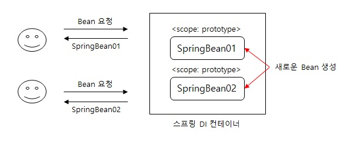
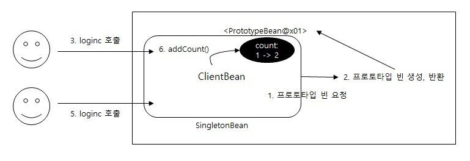
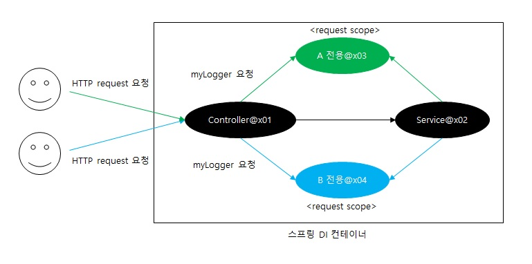

# Bean Scope
Scope는 Bean이 존재할 수 있는 범위이다.

## (1) Scope 종류
<1> 싱글톤: 기본 스코프이며 스프링 컨테이너의 시작과 종료까지 유지되는 가장 넒은 범위의 스코프

<2> 프로토타입: 스프링 컨테이너는 빈의 생성, 의존관계 주입, 초기화까지만 관여하는 매우 짧은 범위의 스코프

<3> 웹 관련 스코프:

* request: 웹 요청이 들어오고 나갈때 까지 유지되는 스코프
* session: 웹 세션이 생성되고 종료될때 까지 유지되는 스코프
* application: 웹의 서블릿 컨텍스트와 같은 범위로 유지되는 스코프

> 빈 스코프 사용 방법
* 컴포넌트 스캔 자동 등록
```
@Scope("prototype")
@Component
public class HelloBean {}
```

* 수동 등록
```
@Scope("prototype")
@Bean
PrototypeBean HelloBean() {
    return new HelloBean();
}
```

---
## (2) 프로토타입 스코프
싱글톤 스코프는 빈을 조회할 경우, 스프링 컨테이너는 항상 같은 인스턴스의 스프링 빈을 반환한다.
프로토타입 스코프에 해당하는 빈을 조회할 경우, 스프링 컨테이너는 항상 새로운 인스턴스를 생성해서 반환한다.

<center>



</center>

> 프로토타입 스코프를 적용할 경우, 스프링 컨테이너는 빈 생성, 의존성 주입, 초기화까지만 진행하고 클라이언트에 빈을 반환하게 된다. 프로토타입이 적용된 빈을 관리할 **책임**은 클라이언트에게 있다. 다시말해, 빈 소멸에 대한 것은 클라이언트가 관리해야 한다.

---
### 프로토타입 빈의 특징 정리

* 스프링 컨테이너에 요청할 때마다 새로 생성
* 스프링 컨테이너는 프로토타입 빈의 생성과 의존관계 주입 그리고 초기화까지만 관여
* 프로토타입 스프링 빈은 종료 메서드가 호출되지 않음
* 클라이언트가 프로토타입 스프링 빈을 직접 관리해야 함(종료 메서드도 직접 호출)

---
## (3) 싱글톤 스프링 빈과 프로토타입 스프링 빈
두 타입의 스코프를 사용할 경우 의도한대로 동작하지 않고 문제가 발생한다.

### 3.1 케이스
> 싱글톤 스프링 빈 내부에 의존관계로 주입되는 스프링 빈이 프로토타입인 경우

<center>



</center>

프로토타입 스프링 빈의 지역변수인 count를 증가하는 addCount를 각 클라이언트가 호출하게 될 경우, 각각 count가 0 -> 1로 증가할거라 예상한다. 하지만 실질적으로 count는 1이 아닌 2가 된다.

* PrototypeBean은 프로토타입 스코프지만 SingletonBean은 싱글톤 스코프이기 때문에, 싱글톤 빈에서 프로토타입 빈을 사용한다.
* 싱글톤 빈의 스코프는 스프링 컨테이너와 같은데, 프로토타입 스코프의 스프링 빈이 새로 생성되기는 했지만 싱글톤 빈과 함께 사용되기 때문에 계속 유지된다.

### 3.2 Provider
싱글톤 빈과 프로토타입 빈을 혼용하는 경우 프로토타입의 의도대로 동작하지 않는 문제를 발견한다.
싱글톤 빈과 프로토타입 빈을 혼용하기 위해 어떻게 할까?

  1. Dependency Lookup(DL)

외부에서 외존관계를 주입(DI) 받는 것이 아닌 직접 필요한 의존 관계를 찾는 것을 Dependency Lookup(DL) 의존관계 조회(탐색)이라 한다.

* ClientBean 핵심 코드 수정

```
static class ClientBean {
    @Autowired
    private ApplicationContext ac;
        public int logic() {
            PrototypeBean prototypeBean = ac.getBean(PrototypeBean.class);
            prototypeBean.addCount();
            int count = prototypeBean.getCount();
            return count;
        }
    }
}
```
> 이렇게 스프링의 애플리케이션 컨텍스트 전체를 주입받게 되면, 스프링 컨테이너에 종속적인 코드가 되고, 단위 테스트가 어려워 짐

  2. ObjectFactory, ObjectProvider
지정한 빈을 컨테이너에서 대신 찾아주는 DL 서비스를 제공하는 것이 바로 ObjectProvider 이다. 추후 편의 기능을 추가해서 ObjectProvider 가 만들졌다.

* ClientBean 핵심 코드 수정
```
static class ClientBean {
    @Autowired
    private ObjectProvider<PrototypeBean> prototypeBeanProvider;
   
    public int logic() {
        PrototypeBean prototypeBean = prototypeBeanProvider.getObject();
        prototypeBean.addCount();
        int count = prototypeBean.getCount();
        return count;
    }
}
```

* ObjectProvider의 getObject()를 호출하면 내부에서 스프링 컨테이너를 통해 해당 빈을 찾아 반환(DL)
* 스프링이 제공하는 기능을 사용하지만, 기능이 단순하므로 단위 테스트나 mock 코드를 만들기 쉬워짐
* ObjectProvider는 딱 필요한 DL 정도의 기능만 제공

> 특징
1. ObjectFactory: 기능이 단순하고 별도의 라이브러리 필요 없음, 스프링에 의존
2. ObjectProvider: ObjectFactory 상속, 옵션, 스트림 처리등 편의 기능이 많고 별도의 라이브러리 필요 없음, 스프링에 의존

---

### 3.3 JSR-330 Provider

* build.gradle에 라이브러리 추가
```
implementaion 'javax.inject:javax.inject:1'
```

* ClientBean 핵심 코드 수정
```
static class ClientBean {
    @Autowired
    private Provider<PrototypeBean> provider;
   
    public int logic() {
        PrototypeBean prototypeBean = provider.get();
        prototypeBean.addCount();
        int count = prototypeBean.getCount();
        return count;
    }
}
```
* provider 의 get() 을 호출하면 내부에서는 스프링 컨테이너를 통해 해당 빈을 찾아서 반환(DL)
* 자바 표준이고, 기능이 단순하므로 단위테스트나 mock 코드를 만들기는 훨씬 쉬워짐
* Provider는 딱 필요한 DL 정도의 기능만 제공

> 특징
1. get() 메서드 하나로 기능이 매우 단순
2. 별도의 라이브러리가 필요
3. 자바 표준이므로 스프링이 아닌 다른 컨테이너에서도 사용 가능

---
## 웹 스코프

* 특징
  1. 웹 환경에서만 동작
  2. 프로토타입과 다르게 스프링이 해당 스코프의 종료시점까지 관리, 따라서 종료 메서드가 호출됨

* 종류
  1. request: HTTP 요청 하나가 들어오고 나갈 때 까지 유지되는 스코프, 각각의 HTTP 요청마다 별도의 빈 인스턴스가 생성, 관리됨
  2. session: HTTP Session과 동일한 생명주기를 가지는 스코프
  3. application: 서블릿 컨텍스트( ServletContext )와 동일한 생명주기를 가지는 스코프
  4. websocket: 웹 소켓과 동일한 생명주기를 가지는 스코프

<center>



</center>

* build.gradle에 라이브러리 추가(web 환경 추가)
```
implementation 'org.springframework.boot:spring-boot-starter-web
```

* spring-boot-starter-web 라이브러리를 추가하면 스프링 부트는 내장 톰켓 서버를 활용해서 웹
서버와 스프링을 함께 실행
* 웹 라이브러리가 없으면 AnnotationConfigApplicationContext을 기반으로 애플리케이션을 구동, 웹 라이브러리가 추가되면 웹과 관련된 추가 설정과 환경들이 필요하므로 AnnotationConfigServletWebServerApplicationContext 를 기반으로 애플리케이션을 구동

1. MyLogger

```
package hello.core.common;
import org.springframework.context.annotation.Scope;
import org.springframework.stereotype.Component;
import javax.annotation.PostConstruct;
import javax.annotation.PreDestroy;
import java.util.UUID;

@Component
@Scope(value = "request")
public class MyLogger {
    private String uuid;
    private String requestURL;

    public void setRequestURL(String requestURL) {
        this.requestURL = requestURL;
    }

    public void log(String message) {
        System.out.println("[" + uuid + "]" + "[" + requestURL + "] " + message);
    }
    
    @PostConstruct
    public void init() {
        uuid = UUID.randomUUID().toString();
        System.out.println("[" + uuid + "] request scope bean create:" + this);
    }

    @PreDestroy
    public void close() {
        System.out.println("[" + uuid + "] request scope bean close:" + this);
    }
}
```
* 로그를 출력하기 위한 MyLogger 클래스
* @Scope(value = "request") 를 사용해 request 스코프로 지정
  * 이제 이 빈은 HTTP 요청 당 하나씩 생성되고, HTTP 요청이 끝나는 시점에 소멸
  * 해당 소스에는 빈이 생성되는 시점에 자동으로 @PostConstruct 초기화 메서드를 사용해서 uuid를 생성해서 저장, HTTP 요청 당 하나씩 생성되므로, uuid를 저장해두면 다른 HTTP 요청과 구분할 수 있음
  * 이 빈이 소멸되는 시점에 @PreDestroy 를 사용해서 종료 메시지를 남김
* requestURL은 이 빈이 생성되는 시점에는 알 수 없으므로, 외부에서 setter로 입력 받음

2. LogDemoController

```
package hello.core.web;

import hello.core.common.MyLogger;
import hello.core.logdemo.LogDemoService;
import lombok.RequiredArgsConstructor;
import org.springframework.stereotype.Controller;
import org.springframework.web.bind.annotation.RequestMapping;
import org.springframework.web.bind.annotation.ResponseBody;
import javax.servlet.http.HttpServletRequest;

@Controller
@RequiredArgsConstructor
public class LogDemoController {
    private final LogDemoService logDemoService;
    private final MyLogger myLogger;
    
    @RequestMapping("log-demo")
    @ResponseBody
    public String logDemo(HttpServletRequest request) {
        String requestURL = request.getRequestURL().toString();

        myLogger.setRequestURL(requestURL);
        myLogger.log("controller test");

        logDemoService.logic("testId");
        return "OK";
    }
}
```
* MyLogger가 잘 작동하는지 확인하는 테스트용 컨트롤러
* HttpServletRequest를 통해서 요청 URL을 받음
  * requestURL 값 http://localhost:8080/log-demo로 받은 requestURL 값을 myLogger에 저장,  myLogger는 HTTP 요청 당 각각 구분되므로 다른 HTTP 요청 때문에 값이 섞이는 걱정은 하지 않아도 됨
* 컨트롤러에서 controller test라는 로그를 남김

3. LogDemoService
```
package hello.core.logdemo;

import hello.core.common.MyLogger;
import lombok.RequiredArgsConstructor;
import org.springframework.stereotype.Service;@Service

@RequiredArgsConstructor
public class LogDemoService {
    private final MyLogger myLogger;

    public void logic(String id) {
        myLogger.log("service id = " + id);
    }
}

```
* 비즈니스 로직이 있는 서비스 계층에서도 로그를 출력
  * request scope를 사용하지 않고 파라미터로 이 모든 정보를 서비스 계층에 넘긴다면, 파라미터가 많아서 지저분해지고 requestURL 같은 웹과 관련된 정보가 웹과 관련없는 서비스 계층까지 넘어가게 됨
  * 웹과 관련된 부분은 컨트롤러까지만 사용해야 함
  * 서비스 계층은 웹 기술에 종속되지 않고, 가급적 순수하게 유지하는 것이 유지보수 관점에서 좋음
* request scope의 MyLogger 덕분에 이런 부분을 파라미터로 넘기지 않고, MyLogger의 멤버변수에
저장해서 코드와 계층을 깔끔하게 유지할 수 있음

> 실행하면 기대와 다르게 에러 발생
```
Error creating bean with name 'myLogger': Scope 'request' is not active for the
current thread; consider defining a scoped proxy for this bean if you intend to
refer to it from a singleton;
```

* 스프링 애플리케이션을 실행 시키면 오류가 발생, 메시지 마지막에 싱글톤이 보임
* 스프링 애플리케이션을 실행하는 시점에 싱글톤 빈은 생성해서 주입이 가능하지만, request 스코프 빈은 아직 생성되지 않음, 이 빈은 실제 고객의 요청이 와야 생성할 수 있음

> 해결 방법
1. Provider
  
* LogDemoController
```
package hello.core.web;

import hello.core.common.MyLogger;
import hello.core.logdemo.LogDemoService;
import lombok.RequiredArgsConstructor;
import org.springframework.beans.factory.ObjectProvider;
import org.springframework.stereotype.Controller;
import org.springframework.web.bind.annotation.RequestMapping;
import org.springframework.web.bind.annotation.ResponseBody;
import javax.servlet.http.HttpServletRequest;

@Controller
@RequiredArgsConstructor
public class LogDemoController {
    private final LogDemoService logDemoService;
    private final ObjectProvider<MyLogger> myLoggerProvider;
    
    @RequestMapping("log-demo")
    @ResponseBody
    public String logDemo(HttpServletRequest request) {
        String requestURL = request.getRequestURL().toString();
        MyLogger myLogger = myLoggerProvider.getObject();

        myLogger.setRequestURL(requestURL);myLogger.log("controller test");
        logDemoService.logic("testId");

        return "OK";
    }
}
```

  * LogDemoService
```
package hello.core.logdemo;

import hello.core.common.MyLogger;
import lombok.RequiredArgsConstructor;
import org.springframework.beans.factory.ObjectProvider;
import org.springframework.stereotype.Service;

@Service
@RequiredArgsConstructor
public class LogDemoService {
    private final ObjectProvider<MyLogger> myLoggerProvider;
    
    public void logic(String id) {
        MyLogger myLogger = myLoggerProvider.getObject();
        myLogger.log("service id = " + id);
    }
}
```

  * 결과
```
[d06b992f...] request scope bean create
[d06b992f...][http://localhost:8080/log-demo] controller test
[d06b992f...][http://localhost:8080/log-demo] service id = testId[d06b992f...] request scope bean close
```

1. ObjectProvider를 사용해 getObject()를 호출하는 시점까지 request scope 빈의 생성을 지연할 수 있음
2. getObject()를 호출하시는 시점에는 HTTP 요청이 진행중이므로 request scope 빈의 생성이 정상 처리
3. getObject()를 LogDemoController , LogDemoService에서 각각 호출해도 같은 HTTP 요청이면 같은 스프링 빈이 반환됨

---
2. Proxy

* MyLogger
```
@Component
@Scope(value = "request", proxyMode = ScopedProxyMode.TARGET_CLASS)
public class MyLogger {
}
```
* proxyMode = ScopedProxyMode.TARGET_CLASS 를 추가
  * 적용 대상이 인터페이스가 아닌 클래스면 TARGET_CLASS를 선택
  * 적용 대상이 인터페이스면 INTERFACES를 선택
* MyLogger의 가짜 프록시 클래스를 만들어두고 HTTP request와 상관 없이 가짜 프록시
클래스를 다른 빈에 미리 주입 가능

### 3.4 웹 스코프와 프록시 동작 원리
프록시를 사용한 MyLogger를 보면

```
System.out.println("myLogger = " + myLogger.getClass());
// myLogger = class hello.core.common.MyLogger$$EnhancerBySpringCGLIB$$b68b726d
```

> CGLIB라는 라이브러리로 내 클래스를 상속 받은 가짜 프록시 객체를 만들어서 주입
* @Scope의 proxyMode = ScopedProxyMode.TARGET_CLASS를 설정하면 스프링 컨테이너는 CGLIB
라는 바이트코드를 조작하는 라이브러리를 사용해서, MyLogger를 상속받은 가짜 프록시 객체를
생성
* 스프링 컨테이너에 "myLogger"라는 이름으로 진짜 대신에 이 가짜 프록시 객체를 등록
* ac.getBean("myLogger", MyLogger.class) 로 조회해도 프록시 객체가 조회되는 것을 확인할 수
있음
  * 의존관계 주입도 이 가짜 프록시 객체가 주입


> 정리
* CGLIB라는 라이브러리로 내 클래스를 상속 받은 가짜 프록시 객체를 만들어서 주입
* Provider를 사용하든, 프록시를 사용하든 핵심은 진짜 객체 조회를 꼭 필요한 시점까지 지연처리 한다는 점(지연 로딩)
* 어노테이션 설정 변경만으로 원본 객체를 프록시 객체로 대체할 수 있음
  * 다형성과 DI 컨테이너가 가진 큰 강점

---
전체 내용들은 (인프런) 김영한님의 스프링 핵심 원리-기본편을 듣고 정리한 내용입니다.