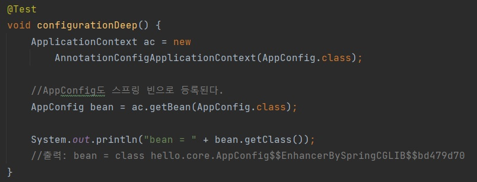
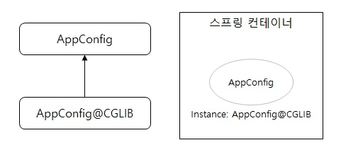

# Singleton Container

## (1) Singleton
클래스의 인스턴스를 딱 1개만 생성, 생성자를 private으로 선언하여 new 키워드를 사용하지 못하도록 한다. 

싱글톤을 구성하는 방법은 여러 방법이 있으나 여기서는 정리하지 않는다.

---

## (2) Spring과 Singleton
스프링이 웹 중심 개발은 아니지만 많은 서비스를 웹으로 개발한다고 보았을 때, 웹에서는 많은 사용자들이 주기적으로 서비스를 요청을 하게 된다. 이런 환경에서의 객체의 생성과 소멸은 메모리 낭비가 심하다.

객체를 1개만 생성하고 이를 공유해서 사용한다면 자원의 낭비를 줄일 수 있다. 이러한 패턴을 싱글톤 패턴이라고 한다.

---

## (3) Singleton의 문제
* 싱글톤 패턴을 구현하는 코드 자체가 많이 들어간다.

* 의존관계상 클라이언트가 구체 클래스에 의존한다. DIP를 위반한다.

* 클라이언트가 구체 클래스에 의존해서 OCP 원칙을 위반할 가능성이 높다.

* 테스트하기 어렵다.

* 내부 속성을 변경하거나 초기화 하기 어렵다.

* private 생성자로 자식 클래스를 만들기 어렵다.

* 결론적으로 유연성이 떨어진다.

* 안티패턴으로 불리기도 한다

---

## (4) Singleton Container

* 싱글턴 패턴을 적용하지 않아도, 객체 인스턴스를 싱글톤으로 관리

* 스프링 컨테이너는 싱글톤 컨테이너 역할을 하며, 싱글톤 객체를 생성하고 관리하는 기능을 <u>**싱글톤 레지스트**</u>라 한다.

* 스프링 컨테이너로 싱글턴 패턴의 모든 단점을 해결하면서 객체를 싱글톤으로 유지할 수 있다.

* 싱글톤 패턴을 구현하기 위해 작성해야 했던 추가적인 코드들이 사라진다.

  - DIP, OCP, 테스트, private 생성자로 부터 자유롭게 싱글톤을 사용할 수 있다

---

## (5) Configuration과 바이트코드 조작

테스트 코드를 출력해보면 출력에 ***CGLIB가 붙어있다. 이는 내가 만든 클래스가 아니라 스프링이 바이트 조작 라이브러리(CGLIB)를 사용해서 AppConfig 클래스를 상속 받은 임의의 다른 클래스를 만들었기 때문이다. 그후 해당 클래스를 스프링 빈으로 등록한다.

추가적으로 @Bean만 사용해도 스프링 빈으로 등록되지만, 싱글톤을 보장하지 않는다.

---

전체 내용들은 (인프런) 김영한님의 스프링 핵심 원리-기본편을 듣고 정리한 내용입니다.