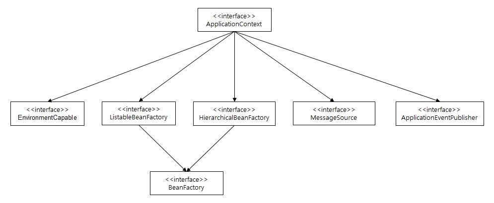
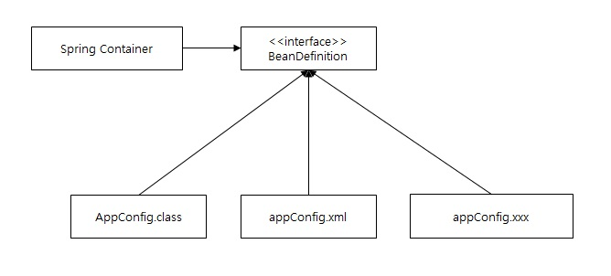
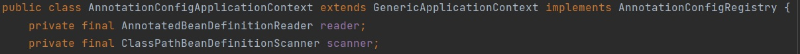
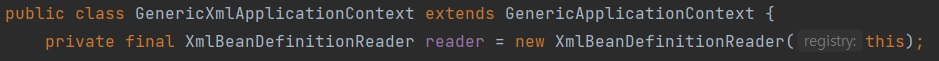
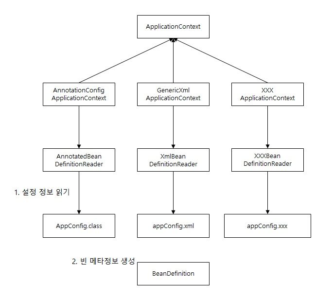

# Container와 Bean


## (1) Spring Container
자바의 생명 주기를 관리하며, 생성된 자바 객체들에게 추가적인 기능을 제공

객체의 생성과 소멸 제어

---

## (2) Spring Bean
스프링 IoC 컨테이너에 의해 관리되는 자바의 객체

---

## (3) IoC(Inversion of Control): 제어의 역전

> 조영호 님의 '오브젝트: 코드로 이해하는 객체지향 설계' 8장 의존성 관리하기 내용 중 발췌

애플리케이션의 기능을 구현하기 위해서는 객체가 다른 객체와의 상호작용(협력)이 필수적이다. 협력은 객체가 다른 객체에 대한 정보를 알게 만든다. 가령, 다른 객체가 어떤 존재인지 알고 있어야 하고 객체가 수신할 수 있는 메tl지에 대해서도 알고 있어야 한다. 객체에 대한 앎은 객체 사이의 <u>**의존성**</u>을 낳는다.

협력은 필수적이고 협력을 위해서는 의존성이 필요하지만, 과도한 의존성은 애플리케이션을 수정하기 어렵게 만든다. 그래서 객체지향 설계는 의존성을 관리하는 것이고 객체가 변화를 받아들일 수 있게 의존성을 정리하는 기술이라고 할 수 있다. 


```
객체지향설계를 잘하기 위한 5대 원칙(SOLID) 중 Dependency Inversion Principle(DIP)를 기억하자. 구현체에 의존하지 말고 추상화에 의존해야 객체지향을 잘 설계 할 수 있다. 그리고 DIP를 따르는 방법 중에 의존성 주입(DI)이 있으며 이는 스프링이 의존성을 줄이기 위한 방법으로 사용 중이다.

정리하자면 의존성을 줄이기 위해 스프링에서는 DI를 사용하고 최종 객체 생성(new, 할당), 제어 담당을 프로그래머가 아닌 스프링이 담당하게 되는데 이를 IoC(제어의 역전)라고 한다.

스프링에서 제어 담당은 Spring Container가 맡게 된다.

```


---

## (4) 스프링 컨테이너 종류
1. BeanFactory

* 빈을 등록, 생성, 조회하고 돌려주는 등 빈을 관리하는 역할
* BeanFactory가 빈의 정의는 즉시 로딩하지만, 빈이 필요하기 전까지 인스턴스화를 하지 않음(Lazy Loding)

2. ApplicationContext

* 빈 팩토리를 상속한, 빈 팩토리를 확장한 향상 된 컨테이너
* BeanFactory보다 더 추가로 기능 제공

BeanFactory는 스프링 컨테이너의 최상위 인터페이스이며 스프링 빈을 관리하는 역할이 정의되어 있다. ApplicationContext는 BeanFactory의 역할(기능)에 추가적인 역할(기능)을 덧붙여 제공하는 인터페이스이다.

<center> 



</center>

---

## (5) BeanDefinition -> 빈 설정 메타정보
Spring과 관련된 설정을 하기 위해서는 두 가지 방법이 존재한다. Java 코드와 XML을 이용하는데,
스프링 컨테이너는 이 메타정보를 기반으로 스프링 빈을 생성한다.

<center> 

 

</center>

---


### Java 설정 구현체
> Java 설정 구현체인 AnnotationConfigApplicationContext를 들어가 보면 AnnotatedBeanDefinitionReader가 있다.

<center> 

 

</center>

AnnotationConfigApplicationContext는 AnnotatedBeanDefinitionReader를 사용하여 해당 설정 정보인 AppConfig.class를 읽고 BeanDefinition를 생성해 전달한다.


### XML 설정 구현체
> XML 설정 구현체인 GenericXmlApplicationContext를 들어가 보면 XmlBeanDefinitionReader가 있다.

<center> 

 

</center>

GenericXmlApplicationContext는 XmlBeanDefinitionReader를 사용하여 해당 설정 정보인 appConfig.xml를 읽고 BeanDefinition를 생성해 전달한다.


### 커스텀 설정 구현체
> 기본적으로 제공하는 Java나 XMl 설정 구현체가 아닌 다른 방법으로 설정을 하고 싶다면 해당 형식을 읽을 수 있는 XXXBeanDefinitionReader를 구현하고 이를 사용하는 XXXApplicationContext를 이용하여 BeanDefinition를 생성하면 된다.


<center> 

 

</center>


---
전체 내용들은 (인프런) 김영한님의 스프링 핵심 원리-기본편을 듣고 정리한 내용입니다.


