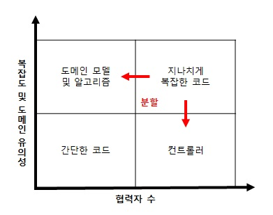
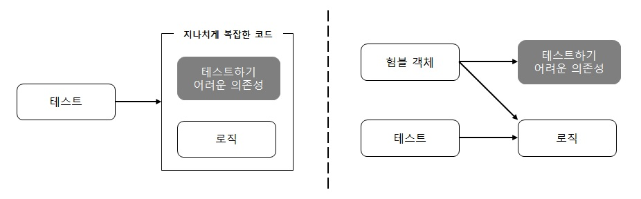

# 가치 있는 단위 테스트를 위한 리팩토링

## (1) 리팩터링할 코드 식별하기

 
리팩터링의 방향을 설명하고자 코드를 네 가지 유형으로 분류

---
### (1.1) 코드의 네 가지 유형

모든 제품 코드는 2차원으로 분류할 수 있음

* 복잡도 또는 도메인 유의성

* 협력자 수

> 복잡도 또는 도메인 유의성

1. 코드 복잡도(code complexity): 코드내 의사 결정(분기) 지점 수에 따라 명시적으로(코드) 그리고 암시적으로(코드가 사용하는 라이브러리) 정의

2. 도메인 유의성(domain significance): 코드가 프로젝트의 문제 도메인에 대해 얼마나 의미 있는지를 나타냄

복잡한 코드와 도메인 유의성을 갖는 코드는 해당 테스트가 회귀 방지에 뛰어나기 때문에 **단위 테스트**에서 가장 이롭다. 하지만 도메인 코드는 복잡할 필요가 없으며, 복잡한 코드는 도메인 유의성이 나타나지 않아도 테스트할 만하다. 이 두 요소는 **서로 독립적**이다.

 

> 협력자 수

(2장 참고) 협력자는 가변 의존성이거나 프로세스 외부 의존성(또는 둘 다)이다.

1. 협력자가 많은 코드는 테스트 비용이 증가
  
   * 테스트 크기에 따라 달라지는 유지 보수성 지표 때문

   * 협력자를 예상되는 조건으로 두고 상태나 상호 작용을 확인하게끔 코드를 작성 필요

   * 협력자가 많을수록 테스트도 커짐

2. 협력자의 유형

: 제품 코드는 복잡도 또는 도메인 유의성과 협력자 수에 따라 네 가지 유형의 코드로 분류

   * 도메인 모델 및 알고리즘: 단위 테스트에 대한 노력 대비 가장 이로움

   * 간단한 코드: 테스트할 가치가 전혀 없음

   * 컨트롤러: 통합 테스트를 통해 간단히 테스트해야 함

   * 지나치게 복잡한 코드: 컨트롤러와 복잡한 코드로 분할해야 함

 

 

코드가 중요하거나 복잡할수록 협력자가 적어야 한다.

---
### (1.2) 험블 객체 패턴을 사용해 지나치게 복잡한 코드 분할하기

지나치게 복잡한 코드를 분할하려면, 험블 객체(Humble Object) 패턴을 써야 한다.

* 험블 객체 패턴: 코드에서 로직을 추출해 코드를 테스트할 필요가 없도록 간단하게 만듬. 추출된 로직은 테스트하기 어려운 의존성에서 분뢰된 다른 클래스로 이동.

 

험블 객체(Humble Object)

나머지 코드는 비즈니스 로직(테스트 가능한 부분)을 둘러싼 얇은 험블 래퍼(humble wrapper), 즉 컨트롤러가 됨.

> 코드의 깊이와 너비의 관점에서 비즈니스 로직과 오케스트레이션(orchestration) 책임을 생각해라! 
: 코드는 깊을 수도 있고(복잡하거나 중요함) 넓은 수도 있지만(협력자가 많음), 둘 다는 아님

 

---
### (1.3) 비즈니스 로직과 오케스트레이션을 분리할 때 중요한 특성

* 도메인 모델 테스트 유의성: 도메인 클래스 내 협력자 수와 유형에 대한 함수

* 컨트롤러 단순성: 컨트롤러에 의사 결정 지점이 있는지에 따라 다름

* 성능: 스포세스 외부 의존성에 대한 호출 수로 정의

---

전체 내용들은 '단위 테스트-생산성과 품질을 위한 단위 테스트 원칙과 패턴 7장'을 정리한 내용입니다.