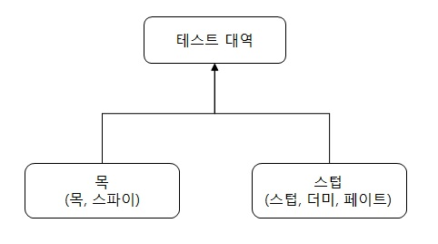

# 목과 테스트 위약성

1. 목과 스텁 구분
2. 식별할 수 있는 동작과 구현 세부 사항 정의
3. 목과 테스트 취약성 간의 관계 이해
4. 리팩터링 내성 저하 없이 목 사용하기

## (1) 목과 스텁 구분

---

### (1.1) 테스트 대역 유형

* 목은 외부로 나가는 상호 작용을 모방하고 검사하는 데 도움이 됨
  * 이러한 상호 작용은 SUT가 상태를 변경하기 위한 의존성을 호출하는 것에 해당

* 스텁은 내부로 들어오는 상호 작용을 모방하는 데 도움이 됨
  * 이러한 상호 작용은 SUT가 입력 데이터를 얻기 위한 의존성을 호출하는 것에 해당

> 목은 SUT와 관련 의존성 간의 상호 작용을 **모방하고 검사** 하는 반면, 스텁은 **모방** 만 함.

=> 관련 내용은 추후 정리, 마틴 파울러의 글 '목은 스텁이 아니다' 참조

---

### (1.2) 도구로서의 목과 테스트 대역으로서의 목

 

&nbsp;목이라는 용어는 두 가지 의미가 있으며, 두 의미를 혼동하지 않는 것이 중요하다. 목 라이브러리(Moq)에 있는 **Mock** 클래스는 테스트 대역(목, mock)을 만들 수 있는 도구다.

 

&nbsp;다시 말해 Mock 클래스는 도구로서의 목인 데 반해, 해당 클래스의 인스턴스인 mock은 테스트 대역으로서의 목이다. 또, Mock 클래스는 **스텁** 도 생성할 수 있다. Mock 클래스는 테스트 대역 유혁인 목과 스텁을 생성할 수 있으니, 도구로서의 목과 테스트 대역으로서의 목 의미를 혼동하지 말자.

 

---
### (1.3) 스텁으로 상호 작용을 검증하지 말라

 

&nbsp;(1.1)에서 언급한 목과 스텁의 차이는 스텁과의 상호 작용을 검증하지 말라는 지침에서 비롯되었다. SUT에서 스텁으로의 호출은 SUT가 생성하는 최종 결과가 아니고 , 최종 결과를 산출하기 위한 수단일 뿐이다.

 

> 테스트에서 거짓 양성을 피하고 리팩터링 내성을 향상시키는 방법은 구현 세부 사항이 아니라 최종 결과를 검증하는 것이다. 하지만, 스텁과의 상호 작용을 검증하는 것은 스텁이 최종 결과가 아니기 때문에 취약한 테스트를 야기하는 일반적인 안티 패턴이다.

 

결과가 올바르다면 SUT가 최종 결과를 어떻게 생성하는지는 중요하지 않다. 만약, 최종 결과가 아닌 사항을 검증하는 했다면 이러한 관행을 **과잉 명세**(overspecification)라고 부른다.
과잉 명세는 상호 작용을 검사할 때 가장 흔하게 발생한다.

> 때로는 목과 스텁의 특성을 모두 나타내는 테스트 대역을 만들 필요가 있다. 이때에는 목이라는 사실이 스텁이라는 사실보다 더 중요하기 때문에 대체로 **목**이라 한다.

 

---
### (1.4) 목과 스텁은 명령과 조회에 어떻게 관련돼 있는가?
&nbsp;목과 스텁의 개념은 명령 조회 분리(CQS, Command Query Separation) 원치과 관련이 있다. 

> CQS 원칙에 따라 명확히 분리하면 코드가 읽기 쉬워진다.

물론 항상 CQS 원칙을 따를 수 있는 것은 아니지만(예, stack.Pop 함수) 가능할 때마다 CQS 원칙을 따르는 것이 좋다.

---

전체 내용들은 '단위 테스트-생산성과 품질을 위한 단위 테스트 원칙과 패턴 5장'을 정리한 내용입니다.

