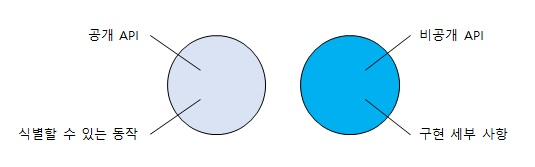

# 목과 테스트 위약성

1. 목과 스텁 구분
2. 식별할 수 있는 동작과 구현 세부 사항 정의
3. 목과 테스트 취약성 간의 관계 이해
4. 리팩터링 내성 저하 없이 목 사용하기

## (1) 목과 스텁 구분

---

### (1.1) 테스트 대역 유형

* 목은 외부로 나가는 상호 작용을 모방하고 검사하는 데 도움이 됨
  * 이러한 상호 작용은 SUT가 상태를 변경하기 위한 의존성을 호출하는 것에 해당

* 스텁은 내부로 들어오는 상호 작용을 모방하는 데 도움이 됨
  * 이러한 상호 작용은 SUT가 입력 데이터를 얻기 위한 의존성을 호출하는 것에 해당

> 목은 SUT와 관련 의존성 간의 상호 작용을 **모방하고 검사** 하는 반면, 스텁은 **모방** 만 함.

=> 관련 내용은 추후 정리, 마틴 파울러의 글 '목은 스텁이 아니다' 참조

---

### (1.2) 도구로서의 목과 테스트 대역으로서의 목

 

&nbsp;목이라는 용어는 두 가지 의미가 있으며, 두 의미를 혼동하지 않는 것이 중요하다. 목 라이브러리(Moq)에 있는 **Mock** 클래스는 테스트 대역(목, mock)을 만들 수 있는 도구다.

 

&nbsp;다시 말해 Mock 클래스는 도구로서의 목인 데 반해, 해당 클래스의 인스턴스인 mock은 테스트 대역으로서의 목이다. 또, Mock 클래스는 **스텁** 도 생성할 수 있다. Mock 클래스는 테스트 대역 유혁인 목과 스텁을 생성할 수 있으니, 도구로서의 목과 테스트 대역으로서의 목 의미를 혼동하지 말자.

 

---
### (1.3) 스텁으로 상호 작용을 검증하지 말라

 

&nbsp;(1.1)에서 언급한 목과 스텁의 차이는 스텁과의 상호 작용을 검증하지 말라는 지침에서 비롯되었다. SUT에서 스텁으로의 호출은 SUT가 생성하는 최종 결과가 아니고 , 최종 결과를 산출하기 위한 수단일 뿐이다.

 

> 테스트에서 거짓 양성을 피하고 리팩터링 내성을 향상시키는 방법은 구현 세부 사항이 아니라 최종 결과를 검증하는 것이다. 하지만, 스텁과의 상호 작용을 검증하는 것은 스텁이 최종 결과가 아니기 때문에 취약한 테스트를 야기하는 일반적인 안티 패턴이다.

 

결과가 올바르다면 SUT가 최종 결과를 어떻게 생성하는지는 중요하지 않다. 만약, 최종 결과가 아닌 사항을 검증하는 했다면 이러한 관행을 **과잉 명세**(overspecification)라고 부른다.
과잉 명세는 상호 작용을 검사할 때 가장 흔하게 발생한다.

> 때로는 목과 스텁의 특성을 모두 나타내는 테스트 대역을 만들 필요가 있다. 이때에는 목이라는 사실이 스텁이라는 사실보다 더 중요하기 때문에 대체로 **목**이라 한다.

 

---
### (1.4) 목과 스텁은 명령과 조회에 어떻게 관련돼 있는가?
&nbsp;목과 스텁의 개념은 명령 조회 분리(CQS, Command Query Separation) 원치과 관련이 있다. 

> CQS 원칙에 따라 명확히 분리하면 코드가 읽기 쉬워진다.

물론 항상 CQS 원칙을 따를 수 있는 것은 아니지만(예, stack.Pop 함수) 가능할 때마다 CQS 원칙을 따르는 것이 좋다.

 

---

## (2) 식별할 수 있는 동작과 구현 세부 사항

 
&nbsp;강조하지만 테스트에 거짓 양성이 있는(결국에는 리팩터링 내성에 실패하는) 주요 이유는 코드의 구현 세부 사항과 결합돼 있기 때문이다. 이렇게 강하게 결합되어 있는 것을 피하는 방법은 코드가 생성하는 최종 결과(식별할 수 있는 동작)를 검증하고 구현 세부 사항과 테스트를 가능한 한 떨어뜨리는 것뿐이다.

 

* 구현 세부 사항과 테스트를 분리!
  * 테스트는 '어떻게'가 아니라 '무엇'에 중점을 두어야 함

---

### (2.1) 식별할 수 있는 동작은 공개 API와 다르다
&nbsp;모든 제품 코드는 2차원으로 분류할 수 있다.

* 공개 API(Application Programming Interface) 또는 비공개 API
* 식별할 수 있는 동작 또는 구현 세부 사항

좌(공개 API, 식별할 수 있는 동작)와 우(비공개 API, 구현 세부 사항)는 트레이드오프 관계이며, 메소드는 둘 중 하나에 속하게 된다.

> 주의할 것은 소제목에 나와 있는 것처럼 위(공개 API)와 아래(식별할 수 있는 동작)는 다르다.

 

> 식별할 수 있는 동작이란? (해당 사항에 없으면 구현 세부 사항)

* (연산) 클라이언트가 목표를 달성하는 데 도움이 되는 연산을 노출
  * 연산은 계산을 수행하거나 부작용을 초래하거나 또는 둘 다 하는 메서드

* (상태) 클라이언트가 목표를 달성하는데 도움이 되는 상태를 노출
  * 상태는 시스템의 현재 상태

잘 설계된 API => 분리가 잘 되어 있음

### (2.2) 잘 설계된 API와 캡슐화

잘 설계된 API를 유지 보수하는 것은 캡슐화 개념과 관련이 있다. 캡슐화는 불변성 위반이라고도 하는 모순을 방지하는 조치다.

> 불변성은 항상 참이어야 함

또, 복잡도 문제때문에 장기적으로 코드베이스 유지 보수에서는 캡슐화가 중요하다. 캡슐화를 올바르게 유지해 코드베이스에서 잘못할 수 있는 상황을 만들지 않도록 하는 것이다.

* 캡슐화는 궁극적으로 단위 테스트와 동일한 목표를 달성!
  * 소프트웨어 프로젝트의 지속적인 성장을 가능하게 함

> API를 잘 설계하여 분리가 잘 되면 단위 테스트가 자동으로 좋아짐

모든 구현 세부 사항을 비공개로 하면 식별할 수 있는 동작만 테스트가 가능하고, 이는 리택터링 내성을 자동으로 좋아지게 한다.

 

---

## (3) 목과 테스트 취약성 간의 관계

---

### (3.1) 육각형(헥사고날) 아키텍쳐
육각형 아키텍쳐는 3가지 지침을 강조

> 육각형 아키텍쳐는 공부해서 추후 다른 파트에서 정리

* 도메인 계층과 애플리케이션 서비스 계층 간의 관심사 분리
  1. 도메인 계층은 해당 비즈니스 로직에 대해서만 책임을 지고 다른 모든 책임에서는 제외

  2. 반대로 애플리케이션 서비스에는 어떤 비즈니스 로직도 있으면 안 됨

  3. 도메인 계층을 애플리케이션의 도메인 지식(사용 방법) 모음으로, 애플리케이션 서비스 계층을 일련의 비즈니스 유스케이스(사용 대상)로 본다.

* 애플리케이션 내부 통신
  1. 애플리케이션 서비스 계층에서 도메인 계층으로 흐르는 단방향 의존성 흐름을 규정

  2. 도메인 계층 내 클래스는 서로에게만 의존하고 애플리케이션 서비스 계층의 클래스에 의존해서는 안 됨 => 이전 지침인 '관심사의 분리'

* 애플리케이션 간의 통신
  1. 애플리케이션 서비스 계층이 유지하는 공통 인터페이스를 통해 연결

  2. 아무도 도메인 계층에 직접 접근할 수 없음

 

잘 설계된 API의 원칙에는 프랙탈 특성이 있는데, 이는 전체 계층만큼 크게도, 단일 클래스만큼 작게도 똑같이 적용된다.

각 계층의 API를 잘 설계하면(구현 세부 사항을 숨기면) 테스트도 프랙탈 구조를 갖기 시작한다. 다시 말해, 달성하는 목표는 같지만 서로 다른 수준에서 동작을 검증한다.

1. 애플리케이션 서비스 테스트는 전반적으로 비즈니스 유스케이스가 어떻게 실행되는지 확인

2. 도메인 클래스 테스트는 유스케이스 완료 방법에 대한 중간의 하위 목표를 검증

> 해당 소파트는 이해가 잘 가지 않고 있음. 도메인 계층의 테스트는 일반적으로 알고 있는 기능(비즈니스)에 대한 단위 테스트를 설명하는 하는 것 같다. 애플리케이션 서비스 계층 테스트는 기능이 모여 하나의 결과(목표?)에 대한 것을 테스트 하는 것 같다.

 

---
### (3.2) 시스템 내부 통신과 시스템 간 통신

* 시스템 내부 통신: 애플리케이션 내 클래스 간의 통신(시스템 내부 <-> 시스템 내부)

  * 시스템 내 통신은 구현 세부 사항임

* 시스템 간 통신: 애플리케이션이 외부 애플리케이션과 통신하는 것(시스템 <-> 외부 시스템)

  * 애플리케이션을 통해서만 접근할 수 있는 외부 시스템을 제외하고 시스템 간 통신은 식별할 수 있는 동작임

  * 애플리케이션을 통해서만 접근할 수 있는 외부 시스템과의 상호 작용도 구현 세부 사항인데, 그 결과의 부작용은 외부에서 확인할 수 없기 때문

 

---

전체 내용들은 '단위 테스트-생산성과 품질을 위한 단위 테스트 원칙과 패턴 5장'을 정리한 내용입니다.

