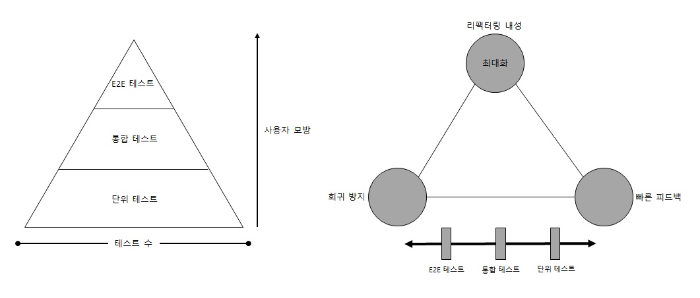

# 좋은 단위 테스트의 4대 요소

 가치 있는 테스를 식별하는 것과 가치 있는 테스트를 작성하는 것은 별개의 기술! 따라서, 가치 있는 테스트를 작성하려면 가치 있는 테스트를 식별할 수 있어야 한다.

## (1) 좋은 단위 테스트 4가지 특성

* 회귀 방지
* 리팩터링 내성
* 빠른 피드백
* 유지 보수성

---

### (1.1) 회귀 방지

 회귀 버그는 이전에 제대로 작동하던 소프트웨어의 코드를 수정(일반적으로 새 기능을 출시한 후)한 후 문제가 생기는 것을 말한다. 회귀 방지는 버그로 인해 회귀하지 않도록 테스트로 검증하는 것이다.

회귀 방지 평가는 다음 사항을 고려해야 한다.
* 테스트 중에 실행되는 코드의 양
* 코드 복잡도
* 코드의 도메인 유의성

---

### (1.2) 리팩터링 내성

 테스트를 실패(빨간색)로 바꾸지 않고 기본 애플리케이션 코드를 리팩터링 할 수 있는지에 대한 척도를 '리팩터링 내성'이라 한다.
 리팩터링은 결과의 변경 없이 코드의 구조를 변경하는 것으로 코드의 가독성을 높이고 유지보수를 편하게 만든다.

> TDD 사이클은 RED(실패) -> GREEN(성공) -> REFACTOR의 반복이다.

개발을 성공하고 리팩터링을 진행한 후 기능은 이상 없지만 테스트가 빨간색이 뜰 수 있는데, 이러한 상황을 **거짓 양성**(**false positive**)이라고 한다. 거짓 양성은 허위 경보다.

> 단위 테스트의 목표는 프로젝트 성장을 지속 가능하게 하는 것이다.

정리하면 좋은 테스트는 회귀 없이 주기적으로 리팩터링하고 새로운 기능을 추가할 수 있게 한다. 여기에는 두 가지 장점이 있다.

* 기존 기능이 고장 났을 때 테스트가 조기 경고를 제공한다. 이러한 조기 경고 덕분에 결함이 있는 코드가 운영 환경에 배포되기 훨씬 전에 문제를 해결할 수 있다. 운영 환경이었으면 문제를 처리하는 데 훨씬 더 많은 노력이 필요했을 것이다.

* 코드 변경이 회귀로 이어지지 않을 것이라고 확신하게 된다. 이러한 확신이 없으면 리팩터링을 하는 데 주저하게 되고 코드베이스가 나빠질 가능성이 훨씬 높아진다.

> 거짓 양성은 이 두가지 이점을 모두 방해한다.

* 테스트가 타당한 이유 없이 실패하면, 코드 문제에 대응하는 능력과 의지가 희석된다. 시간이 흐르면서 그러한 실패에 익숙해지고 그만큼 신경을 많이 쓰지 않는다. 이내 타당한 실패도 무시하기 시작해 기능이 고장 나도 운영 환경에 들어가게 된다.

* 반면에 거짓 양성이 빈번하면 테스트 스위트에 대한 신뢰가 서서히 떨어지며, 더는 믿을 만한 안전망으로 인식하지 않는다. 즉, 허위 경보로 인식이 나빠진다. 이렇게 신뢰가 부족해지면 리팩터링이 줄어든다. 회귀를 피하려고 코드 변경을 최소한으로 하기 때문이다. 

> 리팩터링 내성을 높이는 방법

테스트와 테스트 대상 시스템(SUT)의 구현 세부 사항이 많이 결합할수록 허위 경보가 더 많이 생긴다. 즉, 구현 세부 사항과 테스트 사이를 떨어뜨리고 최종 사용자의 관점에게 의미 있는 결과만 확인해야 한다. 다른 모든 것은 무시해야 한다.

---

### (1.3) 빠른 피드백과 유지보수성

테스트는 빨라야 한다. 빠를수록 테스트 스위트에서 더 많은 테스트를 수행할 수 있고 더 자주 실행할 수 있다.

> 느린 테스트 -> 느린 피드백 -> 버그 수정 비용 증가

마지막으로, 유지보수성 지표는 유지비를 평가한다. 이 지표는 두 가지 주요 요소로 구성된다.

* 테스트가 얼마나 이해하기 어려운가
  
  * 테스트 크기가 작을수록 더 읽기 쉬움
  * 작은 테스트는 필요할 때 변경하기 쉬움
  * 테스트 코드 품질은 제품 코드만큼 중요
  * 테스트 코드를 '일급시민(frist-class citizen)으로 취급해라 

* 테스트가 얼마나 실행하기 어려운가
  
  * 테스트가 프로세스가 외부 종속성으로 작동하는 것에 주의해라
  * 데이터베이스 서버를 재부팅하거나 네트워크 연결 문제를 해결하는 등 의존성을 상시 운영하는데 시간이 들어가게 됨 

---

## (2) 이상적인 테스트

 테스트 코드를 포함한 모든 코드는 책임(liability)이다. 최소한으로 필요한 가치로 임계치를 상당히 높게 설정하고 이 임계치를 충족하는 테스만 테스트 스위트에 남겨라 => 소수의 매우 가치 있는 테스트만 남겨라.

> 극단적인 사례 1: 엔드 투 엔드(E2E, End to End) 테스트

최종 사용자 관점에서 시스템을 살펴보는 테스트를 의미한다. 일반적으로 해당 테스트는 모든 시스템 구성 요소(UI, 데이터베이스, 외부 애플리케이션 등)를 거치게 된다.

1) 장점

* 회귀방지에 우수
* 거짓 양성에 면역이 돼 리팩터링 내성도 우수 

2) 단점

* 느린 속도: 가장 큰 단점으로 빠른 피드백이 어려움

> 극단적인 사례 2: 너무 간단한 테스트

1) 장점

* 리팩터링 내성 우수
* 빠른 피드백

2) 단점

* 회귀 방지가 없음

아무런 가치 없는 테스트가 여러개 발생할 수 있다.

> 극단적인 사례 3: 깨지기 쉬운 테스트(brittle test)

1) 장점

* 빠른 피드백
* 회귀방지에 우수

2) 단점

* 리팩터링 내성이 거의 없음

> 결론

 세가지 극단적인 사례를 보면, 회귀 방지, 리팩터링 내성, 빠른 피드백은 상호 배타적인 관계이다. 세 개를 모두 만족하는 테스트는 실현 불가능한 이상적인 테스트다. 적절한 타협으로 절충안을 선택해야 한다. 그러나 실제로는 리택터링 내성은 포기할 수 없다.

그림으로 살펴보자. **리팩터링 내성** 을 최대한 많이 갖는 것을 목표로 해야하고, 회귀 방지와 빠른 피드백 사이에서 적절하게 타협하는게 좋다.

---

## (3) 블랙박스 테스트와 화이트박스 테스트

* 블랙박스 테스트: 시스템의 내부 구조를 몰라도 시스템의 기능을 검사할 수 있는 소프트웨어 테스트 방법이다. 일반적으로 명세와 요구 사항, 즉 애플리케이션이 어떻게 해야 하는지가 아니라 무엇을 해야 하는지를 중심으로 구축된다.

* 화이트박스 테스트: 애플리케이션의 내부 작업을 검증하는 테스트 방식이며, 테스트는 요구 사항이나 명세가 아닌 소스 코드에서 파생된다.

---

|     | 회귀 방지 | 리팩터링 내성 |
| --- | :--- | :--- |
| 화이트박스 테스트 | 좋음 | 나쁨 |
| 블랙박스 테스트 | 나쁨 | 좋음 |

---

* 테스트를 작성할 때는 블랙박스 테스트 방법을 사용해라.
  
  * 테스트를 통해 비즈니스 요구 사항으로 거슬러 올라갈 수 없다면, 이는 깨지기 쉬운 테스트
  * 이 테스트를 재구성하거나 삭제하라.
  * 알고리즘 복잡도가 높은 유틸리티 코드를 다루는 경우를 제외하고, 기본 테스트 스위트로 두지말라.

* 테스트를 분석할 때는 화이트박스 방법을 사용해라.

---

전체 내용들은 '단위 테스트-생산성과 품질을 위한 단위 테스트 원칙과 패턴 4장'을 정리한 내용입니다.

